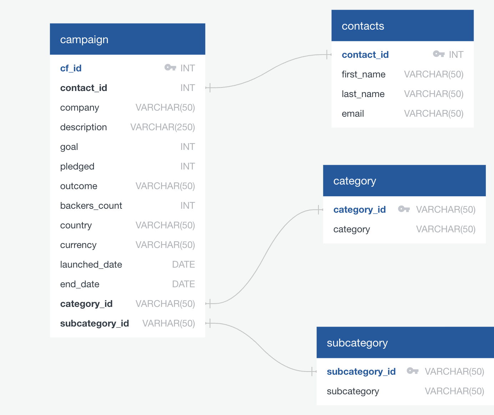
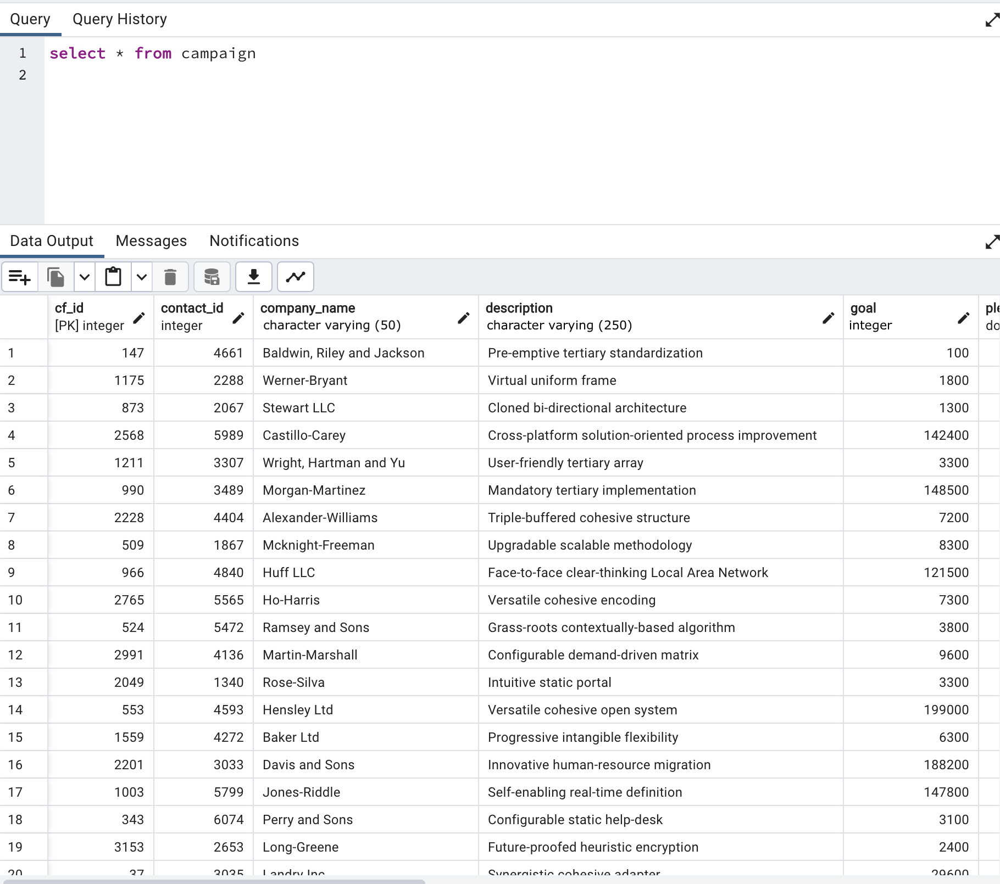
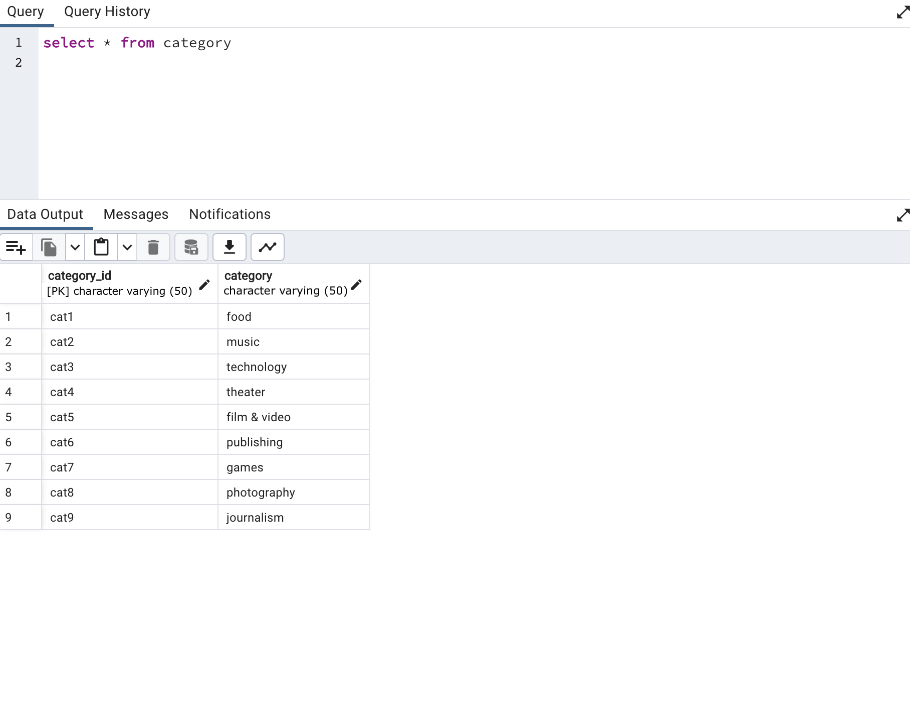
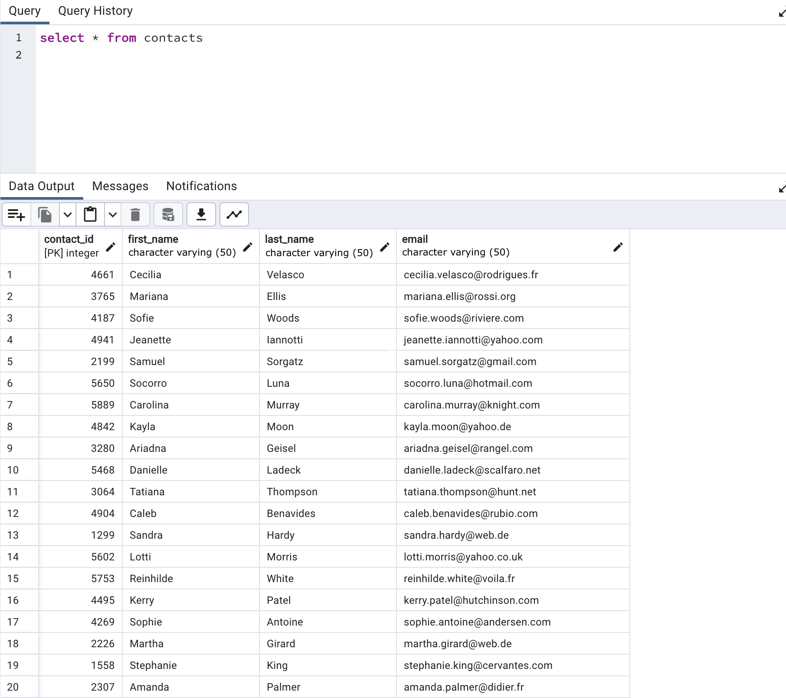
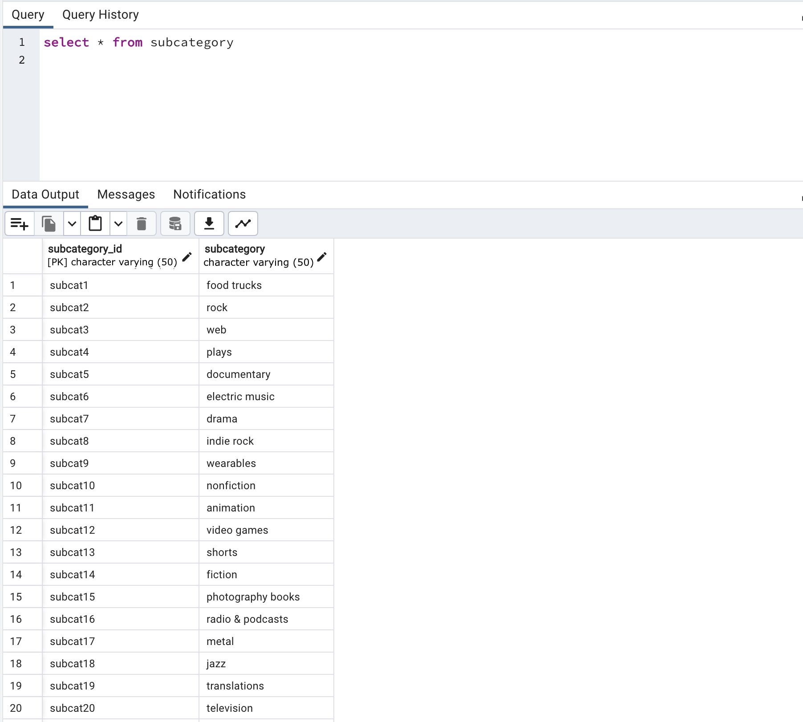

### ETL Mini Project: Crowdfunding Data Analysis

 

### Introduction

In this mini project, we will be working on an ETL (Extract, Transform, Load) pipeline using Python, Pandas, and various data manipulation techniques to extract data from Excel files, transform it into usable formats, and load it into a PostgreSQL database. ETL is a crucial process in data analytics, as it allows us to clean, organize, and prepare raw data for analysis and insights generation.

### What is ETL?

ETL stands for Extract, Transform, Load. It's a process used to collect data from various sources, transform it into a consistent format, and then load it into a database or data warehouse for analysis. This process is fundamental in data analytics as it ensures that data is clean, accurate, and ready for analysis.

- **Extract**: This involves retrieving data from various sources such as databases, APIs, files, or web scraping.

- **Transform**: After extraction, the data often needs to be cleaned, standardized, aggregated, or otherwise transformed to make it suitable for analysis.

- **Load**: Finally, the transformed data is loaded into a target database or data warehouse where it can be queried and analyzed.
Certainly! Let's break down the steps of the project in more detail:

### Step 1: Setting Up the Project

1. **Repository Creation**: A member of the group creates a new repository named "Crowdfunding_ETL" for the project and adds the partner as a collaborator.

2. **Cloning the Repository**: Other members clone the repository to their local machines.

3. **Adding Files**:  The provided Jupyter notebook file is renamed and added it, along with the provided Excel files, to the repository.

4. **Pushing Changes**: The changes are pushed to GitHub, ensuring that all members have access to the notebook file.

### Step 2: Extracting and Transforming Data

#### Creating the Category and Subcategory DataFrames

1. **Extract**: Load the crowdfunding.xlsx Excel file into a Pandas DataFrame.

2. **Transform**: 
   - Create a DataFrame for categories with columns "category_id" and "category".
   - Create a DataFrame for subcategories with columns "subcategory_id" and "subcategory".

3. **Export**: Save the category and subcategory DataFrames as category.csv and subcategory.csv, respectively.

#### Creating the Campaign DataFrame

1. **Extract**: Load the crowdfunding.xlsx Excel file into a Pandas DataFrame.

2. **Transform**: 
   - Rename columns.
   - Convert data types.
   - Handle datetime columns.
   - Match category and subcategory IDs with those from the previous step.

3. **Export**: Save the campaign DataFrame as campaign.csv.

#### Creating the Contacts DataFrame

1. **Extract**: Load the contacts.xlsx Excel file into a Pandas DataFrame.

2. **Option 1 - Using Python Dictionary Methods**:
   - Convert each row to a dictionary.
   - Extract values from dictionaries and create lists.
   - Create a new DataFrame.
   - Split "name" column into first and last names.

4. **Export**: Save the contacts DataFrame as contacts.csv.

### Step 3: Database Setup

1. **ERD Creation**: Inspect the CSV files and sketch an ERD. 

2. **Schema Creation**: Based on the ERD, create a table schema for each CSV file, specifying data types, primary keys, foreign keys, and constraints.

3. **SQL File Creation**: Save the database schema as a Postgres file named crowdfunding_db_schema.sql.

4. **Database Creation**: Create a new Postgres database named "crowdfunding_db".

5. **Table Creation**: Use the database schema to create tables in the correct order to handle foreign keys.

6. **Data Import**: Import each CSV file into its corresponding SQL table.

7. **Verification**: Verify data import by running SELECT statements for each table.

### Results and SQL Schemas

The ETL pipeline resulted in the creation of four CSV files:

1. **category.csv**: Contains information about different categories, with columns "category_id" and "category".

2. **subcategory.csv**: Contains information about subcategories, with columns "subcategory_id" and "subcategory".

3. **campaign.csv**: Contains information about crowdfunding campaigns, including details such as "cf_id", "contact_id", "company_name", "description", "goal", "pledged", "outcome", "backers_count", "country", "currency", "launch_date", "end_date", "category_id", and "subcategory_id".

4. **contacts.csv**: Contains information about contacts, including "contact_id", "first_name", "last_name", and "email".

## The ERD (Entity-Relationship Diagram) for the Crowdfunding Database is as follows:

 

## The SELECT statements for the database are as follows:
### Campaign Table:

 

### Category Table:

 

### Contacts Table:

 

### Subcategory Table:

 

The PostgreSQL database schema has been saved in the file `crowdfunding_db_schema.sql`.

### Conclusion

ETL is a critical process in data analytics that enables organizations to collect, clean, and organize data for analysis. By following a structured approach like the one outlined in this mini project, analysts can ensure that data is reliable, consistent, and ready for insights generation.

### Colaborators
Chantal Thomas, Sarah Demmon, and Paola Roman

### Image Source 
Adobe Stock
